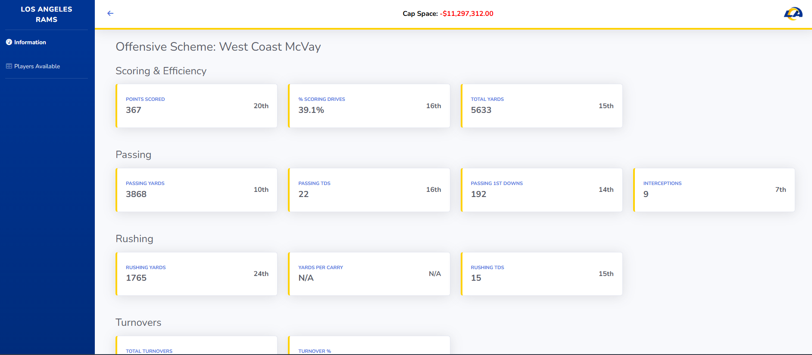
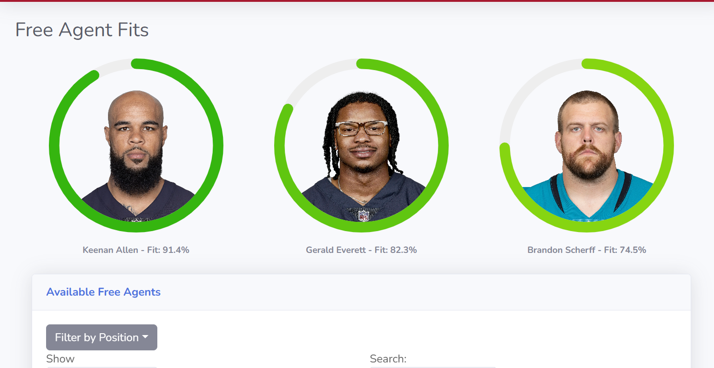
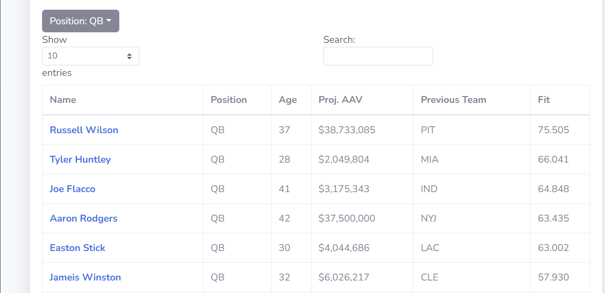
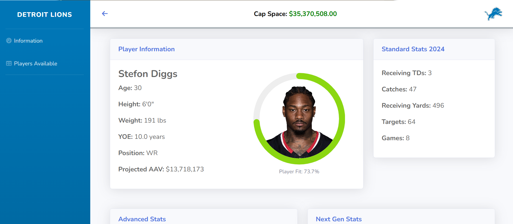
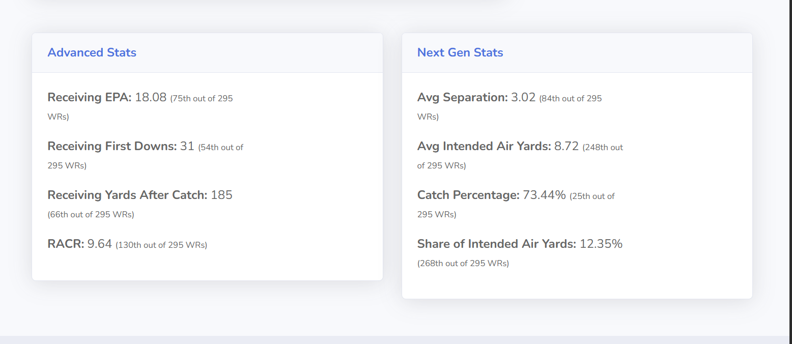

# freeagencyai.com - soon to be published on GCP

## Overview
This tool is designed to evaluate free-agent fits for NFL teams based on **standard, advanced, and Next Gen Stats**. The project currently focuses on **offensive players**, with plans to expand to **defensive positions**.

## Features
- **Team Selection:** Choose an NFL team from the **AFC or NFC**.
- **Scheme Identification:** Displays the selected team's **offensive scheme**.
- **Free Agent Matching:** Filters available **QBs, RBs, and WRs** based on their fit for the team's offensive scheme.
- **Player Fit Analysis:** Each player's fit score is derived using a mix of **standard, advanced, and Next Gen Stats**.
- **Player Stat Screen:** Shows a player's:
  - Basic info (age, height, weight, experience)
  - Contract projection
  - Key stats for performance and scheme fit
- **Scheme Description Popup:** Provides insights into the **team’s offensive philosophy** and how specific attributes are emphasized.

## Future Expansion
- Support for **all offensive and defensive positions**.
- Improved **stat modeling** to enhance fit predictions.
- Integration of **contract projections** and **salary cap impact**.

## UI Flow

Here’s a walkthrough of the core app experience:

### 1. Team Stats & Scheme Overview
Displays the selected team's offensive scheme, overall stats, and cap space.  


### 2. Free Agent Fit Synopsis
Top 3 free agent fits for the selected team, visualized with fit rings.  


### 3. Player Table
Sortable table view of available free agents by position, AAV, and fit.  


### 4. Player Info - Stats & Fit
Shows standard stats, player fit %, contract projection, and player bio.  


### 5. Player Info - Advanced & Next Gen Stats
Highlights advanced metrics like EPA, RACR, separation, air yards, etc.  


## Tech Stack

### **Frontend**
- **Next.js** (React-based framework)
- **Bootstrap** (UI styling)

### **Backend**
- **Python & FastAPI** (API)
- **Machine Learning** (Stat analysis & player fit model)

### **Database**
- **CSV storage** (Player & team data storage)

## Docker Deployment

You can also run the entire application as a single Docker container. The consolidated Docker image is available on Docker Hub.

### Pull the Docker Image
```sh
docker pull daviddozer/front-office-ai-pre-rankings:latest
```

### Run the Docker Container
```sh
docker run -d -p 3000:3000 -p 5000:5000 daviddozer/front-office-ai-pre-rankings:latest
```
This will run the container in detached mode, mapping the container's port 3000 to your host's port 3000 (frontend) and port 5000 to your host's port 5000 (backend).

## Usage
1. Select an **NFL team** from the list.
2. View the **offensive scheme** assigned to the team.
3. See the list of available **free agents (QBs, RBs, WRs)** sorted by **scheme fit**.
4. Click on a player to view **detailed stats & advanced metrics**.
5. Expand the **scheme pop-up** for an explanation of the team's playing style.

---
