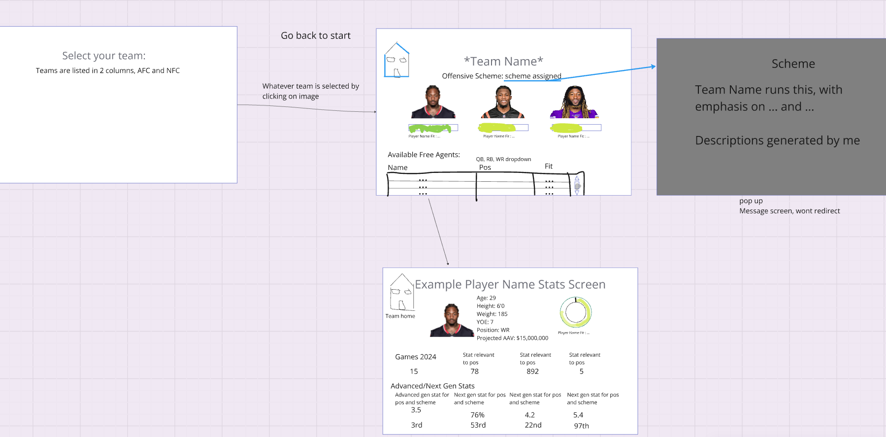

# freeagencyai.com - soon to be published...

## Overview
This tool is designed to evaluate free-agent fits for NFL teams based on **standard, advanced, and Next Gen Stats**. The project currently focuses on **quarterbacks (QBs), running backs (RBs), and wide receivers (WRs)**, with plans to expand to **all offensive and defensive positions**.

## Features
- **Team Selection:** Choose an NFL team from the **AFC or NFC**.
- **Scheme Identification:** Displays the selected team's **offensive scheme**.
- **Free Agent Matching:** Filters available **QBs, RBs, and WRs** based on their fit for the team's offensive scheme.
- **Player Fit Analysis:** Each player's fit score is derived using a mix of **standard, advanced, and Next Gen Stats**.
- **Player Stat Screen:** Shows a player's:
  - Basic info (age, height, weight, experience)
  - Contract projection
  - Key stats for performance and scheme fit
- **Scheme Description Popup:** Provides insights into the **team’s offensive philosophy** and how specific attributes are emphasized.

## Future Expansion
- Support for **all offensive and defensive positions**.
- Improved **stat modeling** to enhance fit predictions.
- Integration of **contract projections** and **salary cap impact**.

## UI Flow


## Tech Stack

### **Frontend**
- **Next.js** (React-based framework)
- **Bootstrap** (UI styling)

### **Backend**
- **Python & FastAPI** (API)
- **Machine Learning** (Stat analysis & player fit model)

### **Database**
- **PostgreSQL** (Player & team data storage)

## Installation
### **1. Clone the Repository**
```sh
git clone https://github.com/your-username/nfl-free-agency-scheme-fitter.git
cd nfl-free-agency-scheme-fitter
```

### **2. Install Dependencies**
#### **Backend (FastAPI & ML)**
```sh
cd backend
pip install -r requirements.txt
```

#### **Frontend (Next.js & Bootstrap)**
```sh
cd frontend
npm install
```

### **3. Run the Project**
#### **Start Backend**
```sh
cd backend
uvicorn app:app --host 0.0.0.0 --port 5000 --reload 
```

#### **Start Frontend**
```sh
cd frontend
npm run dev
```

## Usage
1. Select an **NFL team** from the list.
2. View the **offensive scheme** assigned to the team.
3. See the list of available **free agents (QBs, RBs, WRs)** sorted by **scheme fit**.
4. Click on a player to view **detailed stats & advanced metrics**.
5. Expand the **scheme pop-up** for an explanation of the team's playing style.

---
